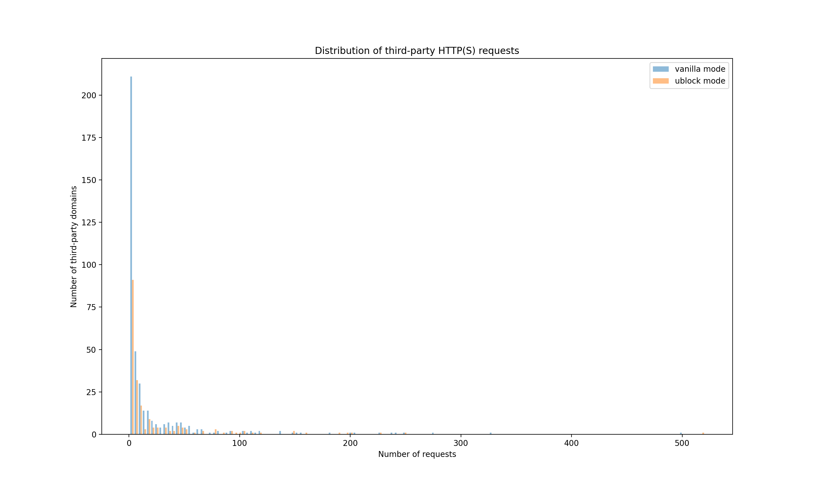

# Intro To OpenWPM

> **_NOTE:_** `top-1m.csv` must start with `index,domain` for the crawler and analysis to work.

## Run the crawler

```python3
python3 crawler.py
```

## Run the analysis

```python3
python3 analysis.py <m>
```

where `<m>` is the measurement to record (set to `"requests"`, `"cookies"`, or `"api"`).

## Analysis

### Third-party HTTP(S) requests

#### Distributions



#### Top 10 third-party HTTP(S) requests

|     | Domain (vanilla)      | Quantity (vanilla) |     | Domain (ublock)       | Quantity (ublock) |
| --: | :-------------------- | -----------------: | --- | :-------------------- | ----------------: |
|   1 | ssl-images-amazon.com |                499 |     | ssl-images-amazon.com |               520 |
|   2 | doubleclick.net       |                328 |     | msocdn.com            |               249 |
|   3 | alicdn.com            |                274 |     | pstatic.net           |               226 |
|   4 | msocdn.com            |                249 |     | alicdn.com            |               200 |
|   5 | google.com            |                241 |     | cloudfront.net        |               198 |
|   6 | pstatic.net           |                239 |     | pinimg.com            |               191 |
|   7 | googlesyndication.com |                228 |     | sinaimg.cn            |               159 |
|   8 | cloudfront.net        |                203 |     | qhimg.com             |               150 |
|   9 | pinimg.com            |                200 |     | awsstatic.com         |               149 |
|  10 | akamaized.net         |                182 |     | twimg.com             |               118 |

### Top 10 third-party cookies

|     | Domain (vanilla)   | Quantity (vanilla) |     | Domain (ublock) | Quantity (ublock) |
| --: | :----------------- | -----------------: | --- | :-------------- | ----------------: |
|   1 | yahoo.com          |                259 |     | amazon.com      |                79 |
|   2 | demdex.net         |                224 |     | microsoft.com   |                24 |
|   3 | casalemedia.com    |                179 |     | bbc.com         |                23 |
|   4 | doubleclick.net    |                165 |     | aliexpress.ru   |                20 |
|   5 | pubmatic.com       |                115 |     | tmall.ru        |                19 |
|   6 | amazon.com         |                115 |     | google.com      |                17 |
|   7 | rubiconproject.com |                108 |     | youtube.com     |                16 |
|   8 | adsrvr.org         |                100 |     | sina.cn         |                15 |
|   9 | linkedin.com       |                 94 |     | live.com        |                14 |
|  10 | adnxs.com          |                 68 |     | taboola.com     |                13 |

### Top 10 third-party JavaScript API calls

|     | Domain (vanilla)     | Quantity (vanilla) |     | Domain (ublock) | Quantity (ublock) |
| --: | :------------------- | -----------------: | --- | :-------------- | ----------------: |
|   1 | forbesimg.com        |               6439 |     | forbesimg.com   |              5025 |
|   2 | wsimg.com            |               2629 |     | wsimg.com       |              2594 |
|   3 | 2mdn.net             |               2413 |     | alicdn.com      |              1044 |
|   4 | media.net            |               2374 |     | itc.cn          |               779 |
|   5 | google-analytics.com |               1781 |     | youtube.com     |               773 |
|   6 | alicdn.com           |               1321 |     | awsstatic.com   |               462 |
|   7 | doubleclick.net      |                976 |     | guim.co.uk      |               388 |
|   8 | adobedtm.com         |                856 |     | bbci.co.uk      |               380 |
|   9 | krxd.net             |                851 |     | segment.com     |               309 |
|  10 | itc.cn               |                847 |     | twitchcdn.net   |               305 |
