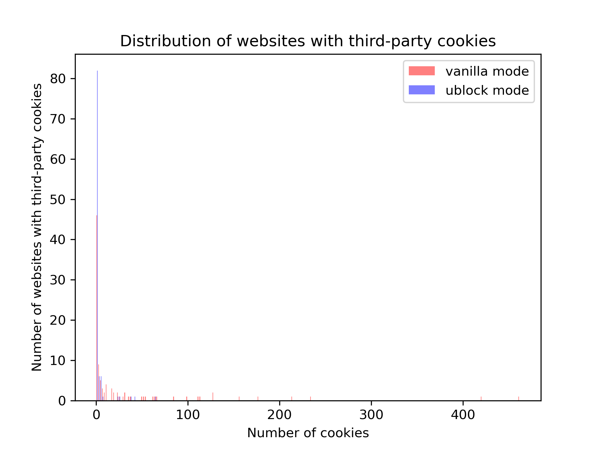
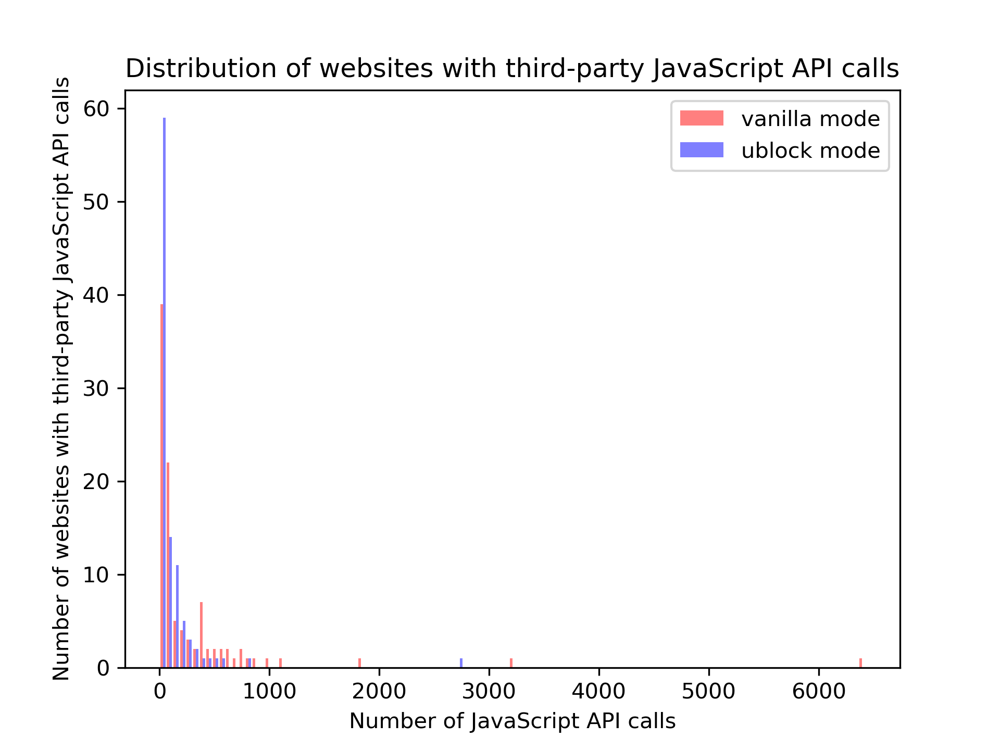

# Intro To OpenWPM

A brief introduction to web-crawling with OpenWPM. The top 100 websites are visited via Firefox (one browser) and recorded in both "vanilla mode" and "ad blocking mode" (using uBlock Origin extension).

The list of the websites is taken from Tranco (https://tranco-list.eu/download_daily/56JN) and should be located in the project's root directory. The tool OpenWPM is taken from Mozilla (https://github.com/mozilla/OpenWPM) and should be located in the project's root directory as `openwpm`.

> **_NOTE:_** top-1m.csv must start with `index,domain` for the csv reading to work properly.

## Activate virtual environment

```python3
conda activate openwpm
```

## Run the crawler

```python3
python3 crawler.py
```

## Run the analysis

```python3
python3 analysis.py <m>
```

where `<m>` is the measurement to record (set to `"requests"`, `"cookies"`, or `"javascript"` to measure the number of HTTP(S) requests, cookies, and JavaScript API calls respectively).

## Analysis

### Third-party HTTP(S) requests

#### Distribution of websites with third-party HTTP(S) requests


More than half of the top 100 websites make from 10 to 120 third-party HTTP(S) requests in both modes (with a lot less websites in vanilla mode than in ublock mode). Specifically, most websites in ublock mode make less than 40 requests and none makes more than 300 requests. There is an even distribution of websites in vanilla mode in the middle and upper range where each website makes anywhere from 130 to 350 requests). Also, in the range of 160-300 requests, there are clearly less websites that make less requests in ublock mode than in vanilla mode.

#### Top 10 third-party domains with HTTP(S) requests

|     | Domain (vanilla)      | Quantity (vanilla) |     | Domain (ublock)       | Quantity (ublock) |
| --: | :-------------------- | -----------------: | --- | :-------------------- | ----------------: |
|   1 | ssl-images-amazon.com |                499 |     | ssl-images-amazon.com |               520 |
|   2 | doubleclick.net       |                328 |     | msocdn.com            |               249 |
|   3 | alicdn.com            |                274 |     | pstatic.net           |               226 |
|   4 | msocdn.com            |                249 |     | alicdn.com            |               200 |
|   5 | google.com            |                241 |     | cloudfront.net        |               198 |
|   6 | pstatic.net           |                239 |     | pinimg.com            |               191 |
|   7 | googlesyndication.com |                228 |     | sinaimg.cn            |               159 |
|   8 | cloudfront.net        |                203 |     | qhimg.com             |               150 |
|   9 | pinimg.com            |                200 |     | awsstatic.com         |               149 |
|  10 | akamaized.net         |                182 |     | twimg.com             |               118 |

Many of these domains seem to be CDN distributors (msocdn.com - for Microsoft Office, cloudfront.net, or akamaized.net). ssl-images-amazon.com, which is apparently a server that stores images for Amazon web pages, makes the most requests in both modes. Similarly, pinimg.com is Pinterest's server for images but it ranks lower in the list. Noticably, doubleclick.net by Google (placed second on the list in vanilla mode) is an advertising service which is agressively blocked in ublock mode.

### Third-party cookies

#### Distribution of websites with third-party cookies



The majority of the top 100 websites contains about 0-25 third-party cookies (85% and 55% of the websites in vanilla mode and ublock mode respectively). The rest of the websites in ublock mode is in the range from 25 to 80 cookies. Meanwhile, websites in vanilla mode distribute quite evenly in the that same range (in more quantity) and also from 120-130 cookies. Remarkably, there are quite many websites in vanilla mode that makes over 200 cookies, with a couple even reaching over 410 cookies.

#### Top 10 third-party domains with cookies

|     | Domain (vanilla)   | Quantity (vanilla) |     | Domain (ublock) | Quantity (ublock) |
| --: | :----------------- | -----------------: | --- | :-------------- | ----------------: |
|   1 | yahoo.com          |                259 |     | amazon.com      |                79 |
|   2 | demdex.net         |                224 |     | microsoft.com   |                24 |
|   3 | casalemedia.com    |                179 |     | bbc.com         |                23 |
|   4 | doubleclick.net    |                165 |     | aliexpress.ru   |                20 |
|   5 | pubmatic.com       |                115 |     | tmall.ru        |                19 |
|   6 | amazon.com         |                115 |     | google.com      |                17 |
|   7 | rubiconproject.com |                108 |     | youtube.com     |                16 |
|   8 | adsrvr.org         |                100 |     | sina.cn         |                15 |
|   9 | linkedin.com       |                 94 |     | live.com        |                14 |
|  10 | adnxs.com          |                 68 |     | taboola.com     |                13 |

Alarmingly, most of the domains in the vanilla list (casalemedia.com, doubleclick.net, pubmatic.com, rubiconproject.com, adsrvr.org, adnxs.com) are digital from ad exchanging/tracking platforms. Also, demdex.net by Adobe Analytics is a capturer of behavioral data that tracks and identifies unique users across websites. With uBlock Origin in action, the number of cookies drastically reduces and those aforementioned domains seem to be blocked completely. In ublock mode, most of the domains are of well-known companies like Amazon, Microsoft, Google, BBC News,...

### Third-party JavaScript API calls

#### Distribution of websites with third-party JavaScript API calls



Most of the websites make from 10 to 800 third-party JavaScript API calls in both modes. In this lower range, there are many more websites in ublock mode which makes a lot less calls than in vanilla mode. Some websites makes from 1000 to 3000 calls in vanilla mode. Noticably, there are one website in ublock mode and one in vanilla mode that make up to 5000 calls and 9500 calls to third-party hosts respectively.

#### Top 10 third-party domains with JavaScript API calls

|     | Domain (vanilla)     | Quantity (vanilla) |     | Domain (ublock) | Quantity (ublock) |
| --: | :------------------- | -----------------: | --- | :-------------- | ----------------: |
|   1 | forbesimg.com        |               6439 |     | forbesimg.com   |              5025 |
|   2 | wsimg.com            |               2629 |     | wsimg.com       |              2594 |
|   3 | 2mdn.net             |               2413 |     | alicdn.com      |              1044 |
|   4 | media.net            |               2374 |     | itc.cn          |               779 |
|   5 | google-analytics.com |               1781 |     | youtube.com     |               773 |
|   6 | alicdn.com           |               1321 |     | awsstatic.com   |               462 |
|   7 | doubleclick.net      |                976 |     | guim.co.uk      |               388 |
|   8 | adobedtm.com         |                856 |     | bbci.co.uk      |               380 |
|   9 | krxd.net             |                851 |     | segment.com     |               309 |
|  10 | itc.cn               |                847 |     | twitchcdn.net   |               305 |

Noticably, at least three of the 10 domains in the vanilla list are from Google (2mdn.net - a server by Double Click, google-analytics.com, and doubleclick.net - now owned by Google), all of which make over 5000 calls and are blocked agressively by uBlock Origin. Placed second in the vanilla list is wsimg.com, which seems to be a media site that is hostile and was blocked by Google Safe Browing. With uBlock Origin on, those mentioned sites are no longer in the list. Also, there is a decrease in the number of calls and the domains seems somewhat more legit in ublock mode, yet the decrease is very small.
